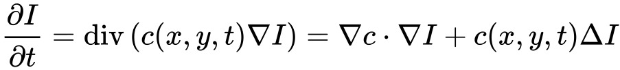

# Perona-Malik-Diffusion
Perona–Malik diffusion, also called anisotropic diffusion, is a technique aimed at reducing image noise presented by [Perona and Malik in 1987](https://authors.library.caltech.edu/6498/1/PERieeetpami90.pdf).
The main idea is to blur the uniform areas of the images to wash out noise while keeping the strong edges of the image intact. 
It is based on the equation of heat diffusion in a non-uniform medium. Different brightness levels are treated as different temperatures and edges are considered as materials with a low heat diffusion coefficient(thermal insulating material). The equation that describes the Perona-Malik diffusion is the following:

where I is the intensity function representing the brightness levels of the image and c is a function that is equal to 1 when the gradient norm is zero and goes to 1 when the gradient norm tends to infinity.

The folder contains both an explicit solution and a semi-implicit solution to the differential equation in MATLAB. It can be used to remove noise from both gray-scale and RGB images. 

