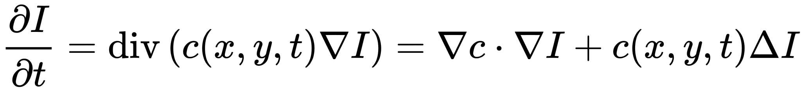

# Perona-Malik-Diffusion
Perona–Malik diffusion, also called anisotropic diffusion, is a technique aimed at reduce image noise presented by Perona and Malik in 1987.
The main idea is to blur the uniform areas of the images to wash out noise, while keeping the strong edges of the image intact. 
It is based on the equation of heat diffusion in a non-uniform medium. Different brightness levels aree treated as different temperatures and edges are considered as materials with a low heat diffusion coefficient(thermal insulating material). The equation theat describes the Perona-Malik diffusion is the following:

